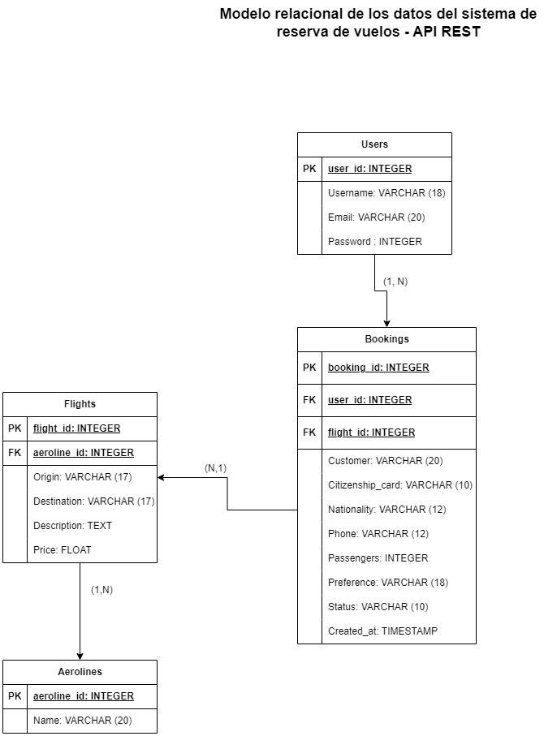
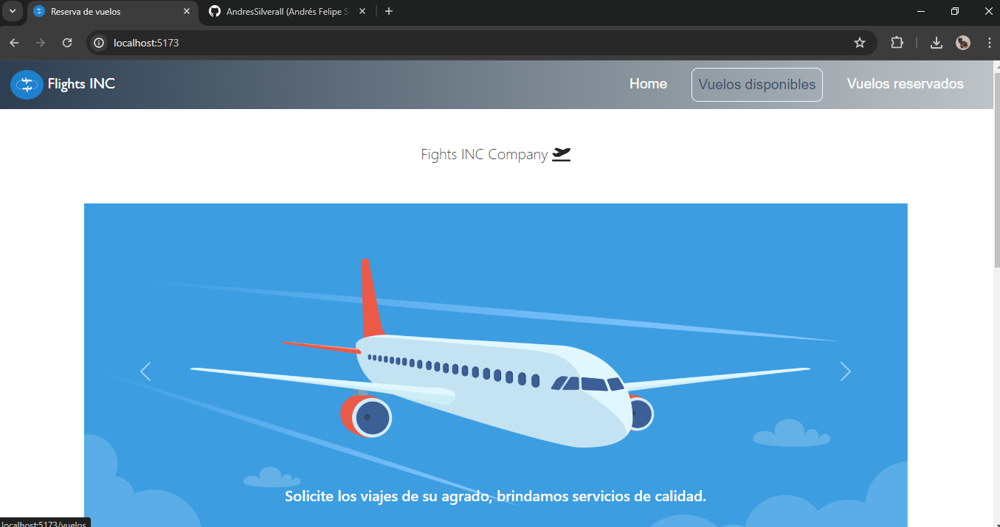
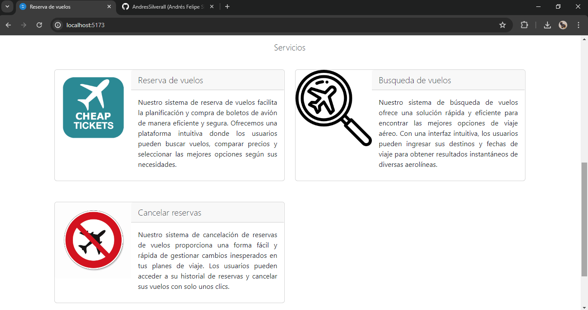
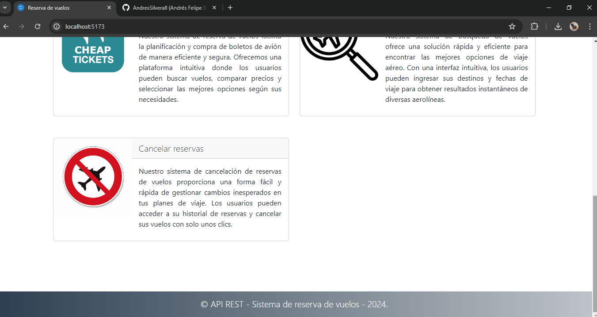
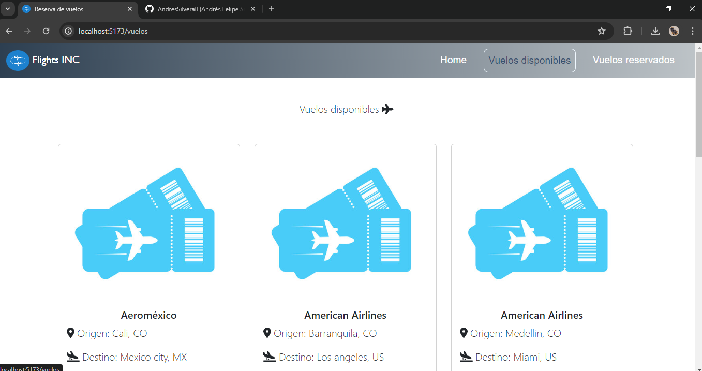
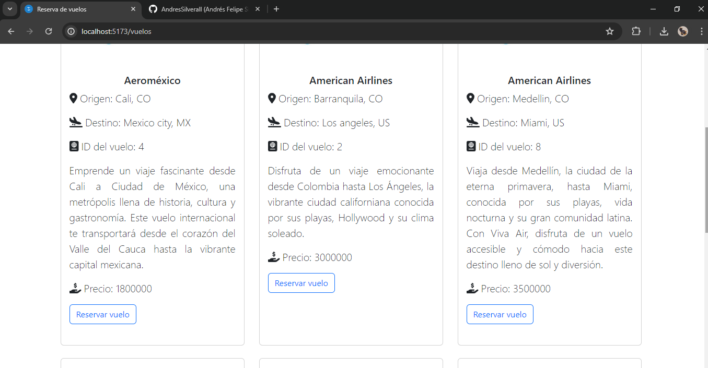
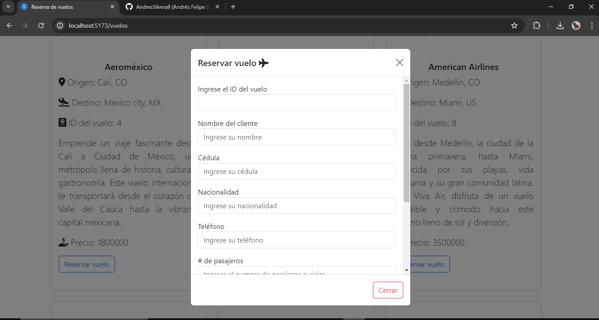
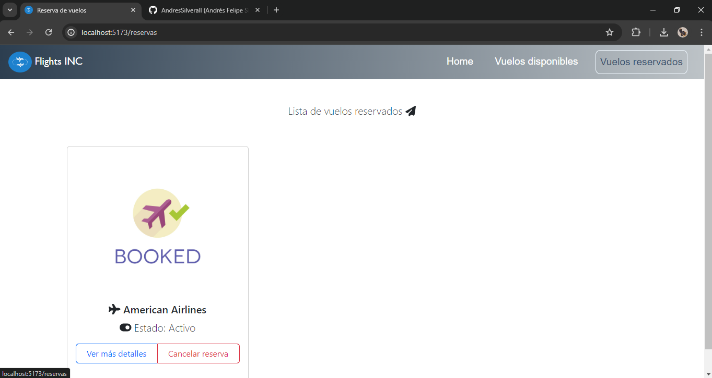
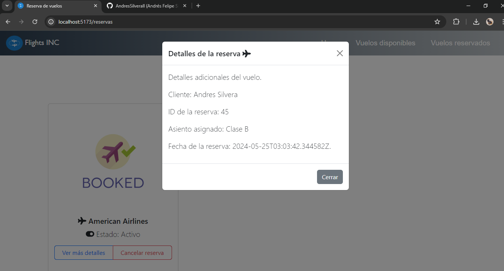

# Prueba tecnica NativApps
Prueba tecnica para el desarrollo de una API REST basada en un sistema de reverva de vuelos, backend desarrollado con Python y el consumo de la API con React JS.

## Requerimientos funcionales
- Buscar vuelos
- Seleccionar vuelo
- Realizar reserva
- Obtener detalles de la reserva
- Cancelar reserva

## Modelo relacional reserva de vuelos

## Paso a paso de la configuracion e instalacion

## Capturas

### Home page

### Vuelos disponibles

### Reservar vuelo

### Vuelos reservados

### Detalles de la reserva

### Cancelar reserva

