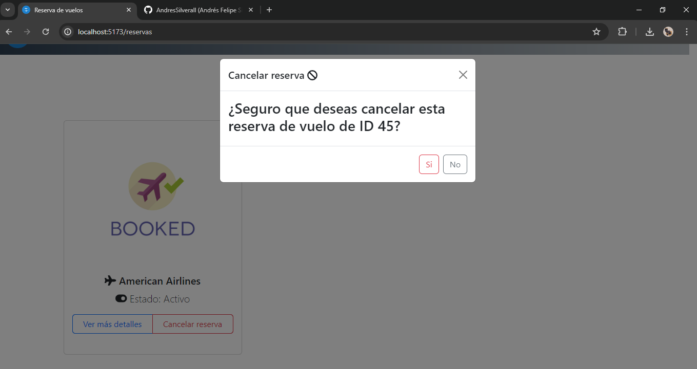

# Prueba tecnica NativApps
Prueba tecnica para el desarrollo de una API REST basada en un sistema de reverva de vuelos, backend desarrollado con Python y el consumo de la API con React JS.


## Requerimientos funcionales
- Buscar vuelos
- Seleccionar vuelo
- Realizar reserva
- Obtener detalles de la reserva
- Cancelar reserva

## Modelo relacional reserva de vuelos


## Instalación y configuración del backend

1. Clona este repositorio: ` git clone https://github.com/AndresSilverall/prueba-tecnica-nativapps.git`

2. Instale un administrador de entornos virtuales desde el gestor de paquetes de Python con el siguiente comando desde la terminal:  `pip install pipenv`

3. Una vez ya instalado navegue a la carpeta del proyecto: `cd prueba-tecnica-nativapps`

4. Ingrese el siguiente comando desde la terminal para activar el entorno virtual e instalar todas las dependencias del backend que se encuentran alojadas en el archivo `Pipfile` del directorio raiz: `pipenv install`

5. Luego active el entorno virtual con el siguiente comando: `pipenv shell`

6. Navegue hacia la carpeta backend: `cd backend`

7. Ejecutar el siguiente comando para las migraciones de la base de datos: `python manage.py makemigrations` luego ejecute `python manage.py migrate` (Es recomendable primero configurar la BD antes de ejecutar todo este punto 7)

8. Para levantar el servidor use el siguiente comando: `python manage.py runserver`


## Configuración para la base de datos

1. Primero debe crear una base de datos de manera local desde `MySQL Workbench` de la siguiente forma:

```sql
-- Recomiendo crear una base de datos con el nombre del proyecto.
CREATE DATABASE bookingFlights;

```
2. Una vez creada la base de datos debe agregar las credenciales de acceso en el archivo `.env` el cual contiene las variables de entorno:

```python

DB_NAME=bookingFlights # Nombre de la base de datos creada en la plataforma del usuario.
DB_HOST=localhost # El localhost donde de la base de datos (es decir la maquina en la que corre la db)
DB_USER=root # Los privilegios de usuarios
DB_PASSWORD= # La ontraseña de la base de datos del cliente
DB_PORT=3306 # El puerto en el que corre la base de datos

```

## Instalación y configuración del frontend

> 💡 **Nota:** Para la gestión del proyecto de React se usó Vite, link de instalación: [https://carlosazaustre.es/react-vite](https://carlosazaustre.es/react-vite)


1. Navegue a la carpeta frontend: `cd frontend`, luego a la carpeta del proyecto `cd booking-flight`

2. Instalar todas las dependencias del proyecto con: `npm install`

3. Luego iniciar el servidor con: `npm run dev`

> **⚠️ Asegurarse de que ambos servidores (backend y frontend) estén en funcionamiento.**


## Capturas

### Home page


### Vuelos disponibles


### Reservar vuelo


### Vuelos reservados


### Detalles de la reserva


### Cancelar reserva

